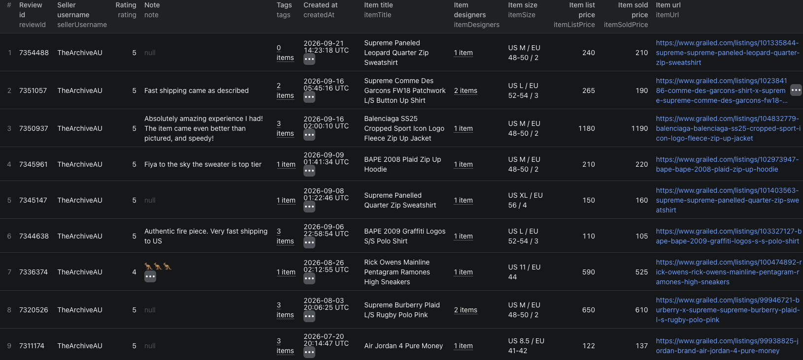

# How to Scrape Grailed Seller Reviews in Node.js

Use the [Grailed Reviews Scraper](https://apify.com/piotrv1001/grailed-reviews-scraper) through Apify's Node.js client. This example calls an existing Actor; it does not implement a scraper.



The screenshot shows a separate `TheArchiveAU` run; the sample code below starts with `graymatter_`.

## What this example does

- Passes a small input to the Actor
- Waits for the run to finish
- Fetches the run's dataset
- Prints the returned rows

## Prerequisites

Node.js, an Apify account, and an Apify API token.

## Installation

```bash
npm install
```

## Environment setup

Copy `.env.example` to `.env` and replace the sample value with your Apify API token.

## Usage

```bash
npm start
```

The sample input is deliberately capped at 10 reviews for one seller. Edit `src/index.js` to change the URLs or limit.

## Code example

```js
import { ApifyClient } from 'apify-client';
import 'dotenv/config';

// Initialize the ApifyClient with your Apify API token
// Set APIFY_TOKEN in your .env file (copy .env.example to get started)
const client = new ApifyClient({
    token: process.env.APIFY_TOKEN,
});

// Prepare Actor input
const input = {
    "sellers": [
        "https://www.grailed.com/graymatter_"
    ],
    "maxReviews": 10,
    "onlyWithNotes": false
};

// Run the Actor and wait for it to finish
const run = await client.actor("piotrv1001/grailed-reviews-scraper").call(input);

// Fetch and print Actor results from the run's dataset (if any)
console.log('Results from dataset');
console.log(`💾 Check your data here: https://console.apify.com/storage/datasets/${run.defaultDatasetId}`);
const { items } = await client.dataset(run.defaultDatasetId).listItems();
items.forEach((item) => {
    console.dir(item);
});

// 📚 Want to learn more 📖? Go to → https://docs.apify.com/api/client/js/docs
```

## Example output

`sample-output.json` is an **illustrative shape**, not a captured run. The dataset can include seller profile, rating, note, tags, item designer, size, and recorded sold price. Fields may be absent when the source does not provide them. The current Actor and source page determine the actual output.

## Use cases

- Review recent transaction feedback for one seller
- Compare seller ratings with individual written comments
- Track which sold items appear in reviews
- Export sold-item context for resale research

## Try the Actor on Apify

**[Open the Grailed Reviews Scraper on Apify](https://apify.com/piotrv1001/grailed-reviews-scraper)**

## Related resources

- [Step-by-step blog guide](https://www.falconscrape.com/blog/how-to-vet-grailed-sellers-with-reviews)

## License

MIT
